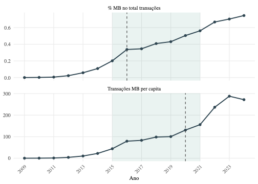
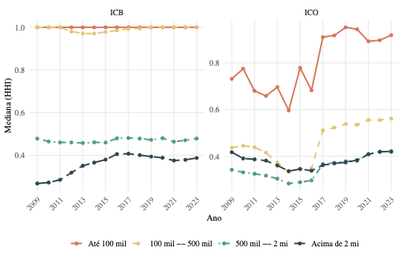
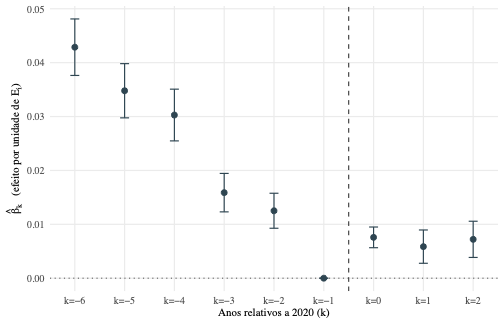
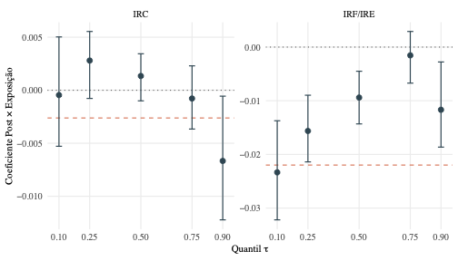

<div align="center">

# Digitalização Bancária e Assimetrias Regionais no Brasil

### Reconfiguração das Redes de Agências, Qualidade do Crédito e Deslocamento Espacial (2009–2023)

*Dissertação de mestrado em Economia — CEDEPLAR / UFMG*

[](LICENSE)
[](https://www.r-project.org/)
[](https://quarto.org/)
[](https://www.latex-project.org/)
[](https://github.com/flaviohugo14/masters-thesis/stargazers)
[](https://github.com/flaviohugo14/masters-thesis/network/members)
[](https://github.com/flaviohugo14/masters-thesis/commits/main)

</div>

---

## Sobre

Esta dissertação investiga como a digitalização do sistema financeiro brasileiro reconfigurou as desigualdades regionais entre 2009 e 2023, articulando três eixos: (i) a reconfiguração espacial das redes bancárias; (ii) o viés metropolitano da digitalização; e (iii) os efeitos assimétricos da concentração geográfica sobre a qualidade do crédito. A estratégia empírica combina datação de quebras estruturais (Bai-Perron, Quandt-Andrews, Chow), DiD contínuo com event study, modelos espaciais SLX, mediação causal (Imai-Keele-Tingley), regressão quantílica espacial via Canay (2011) e estudos de caso territoriais em Minas Gerais.

> *Modelos consagrados, sejam neoclássicos, de causação cumulativa ou de insumo-produto, tratam a moeda e os fluxos monetários como exógenos, incapazes de explicar as assimetrias regionais.* — Crocco et al. (2006)

---

## Resultados em destaque

<table>
  <tr>
    <td width="50%" align="center">
      <br/>
      <sub><b>Datação do choque digital</b><br/>Bai-Perron sobre participação MB e transações móveis per capita identifica quebra em 2020.</sub>
    </td>
    <td width="50%" align="center">
      <br/>
      <sub><b>Concentração bancária por porte</b><br/>HHI de crédito (ICO) e depósitos (ICB) por classe de PIB municipal, 2009–2023.</sub>
    </td>
  </tr>
  <tr>
    <td width="50%" align="center">
      <br/>
      <sub><b>Event study (DiD contínuo)</b><br/>Efeito de uma unidade de exposição ex-ante sobre <i>n_agências</i> em torno de <i>t*</i> = 2020.</sub>
    </td>
    <td width="50%" align="center">
      <br/>
      <sub><b>Quantílica espacial (Canay 2011)</b><br/>Coeficientes em τ ∈ {0,10; 0,25; 0,50; 0,75; 0,90} com bootstrap de blocos por município.</sub>
    </td>
  </tr>
</table>

---

## Estrutura

```
.
├── thesis/              Fontes da dissertação (Quarto + LaTeX ABNT)
│   ├── index.qmd        Documento principal
│   ├── tex/             Templates LaTeX (classe ABNT, capa)
│   ├── csl/abnt.csl     Estilo de citação ABNT (NBR 10520/6023)
│   ├── references/      Bibliografia BibTeX
│   └── images/          Figuras estáticas
├── presentation/        Slides de defesa (Beamer)
├── R/                   Pipeline reprodutível
│   ├── 01_construir_indicadores.R         ESTBAN + IBGE → indicadores
│   ├── 01b_…_legacy.R                     Versão BigQuery direta
│   ├── 02_mediacao.R                      Mediação causal (IKT)
│   ├── 03_robustez.R                      Placebo, DiD sintético, W alt.
│   └── 04_quantilica.R                    Quantílica espacial (Canay)
├── data/{raw,processed,cache}/            Dados (gitignored)
├── assets/                                 Figuras p/ README
└── renv.lock                               Dependências R pinadas
```

---

## Replicação

### Pré-requisitos

- **R** ≥ 4.3 (testado em 4.5.2)
- **Quarto** ≥ 1.4
- **XeLaTeX** (TinyTeX ou TeX Live completo)
- Fonte **Times New Roman**
- Conta no **Google Cloud / BigQuery** (apenas para reconstruir indicadores do zero)

### Setup

```bash
# Restaurar dependências R a partir de renv.lock
Rscript -e "renv::restore()"
```

### Render

```bash
# A partir da raiz do projeto
quarto render thesis/index.qmd        # → thesis/index.pdf
xelatex -output-directory=presentation presentation/defesa.tex
```

> `_quarto.yml` define `execute-dir: project`, então paths em chunks R são relativos à raiz do repo.

### Pipeline de dados

```bash
Rscript R/01_construir_indicadores.R   # Indicadores municipais (ESTBAN + IBGE)
Rscript R/02_mediacao.R                # → data/cache/mediacao.rds
Rscript R/03_robustez.R                # → data/cache/robustez.rds
Rscript R/04_quantilica.R              # → data/cache/quantilica.rds
```

---

## Fontes de dados

| Fonte | Cobertura | Uso |
|---|---|---|
| **ESTBAN** (Base dos Dados / BigQuery) | 2009–2023 | Estatística bancária por município |
| **IBGE** — PIB municipal | 2002–2023 | Deflator IPCA (base 2021) |
| **FEBRABAN** — Pesquisa de tecnologia | 2009–2024 | Séries de digitalização (MB, IB, transações) |
| **UNICAD/Bacen** | — | Classificação de porte das instituições |
| **geobr** | 2020 | Malha municipal IBGE (W espacial) |

---

## Autor

<div align="left">

**Flávio Hugo Pangracio Silva**
Mestrando em Economia — CEDEPLAR / UFMG
Orientador: Prof. Dr. Marco Aurélio Crocco Afonso

[](mailto:flaviohugo.14@gmail.com)
[](https://github.com/flaviohugo14)
[](https://www.linkedin.com/in/flaviopangracio/)
[](https://orcid.org/0000-0003-4045-101X)

</div>

---

## Licença

Distribuído sob a [Licença MIT](LICENSE). O texto da dissertação e suas figuras estão sujeitos às normas da UFMG e da CAPES para trabalhos acadêmicos.

<div align="center">
<sub>Se este trabalho te ajudou, considere deixar uma ⭐ no repositório.</sub>
</div>
